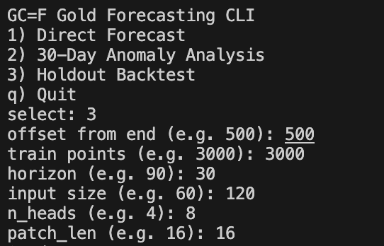
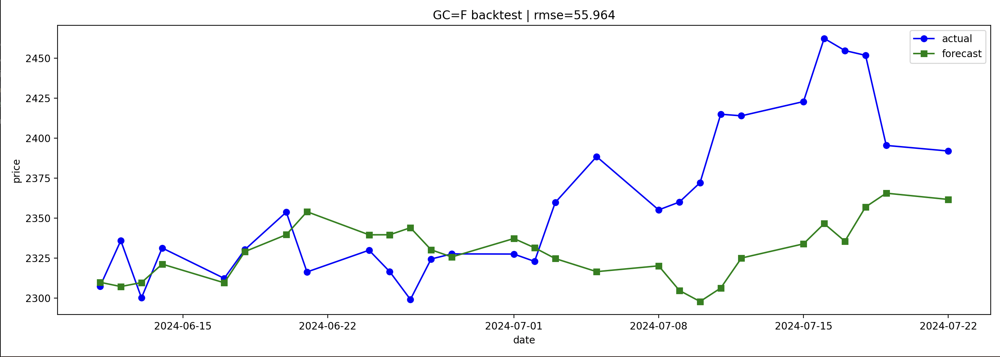
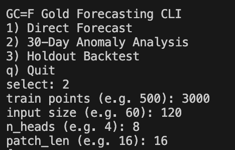
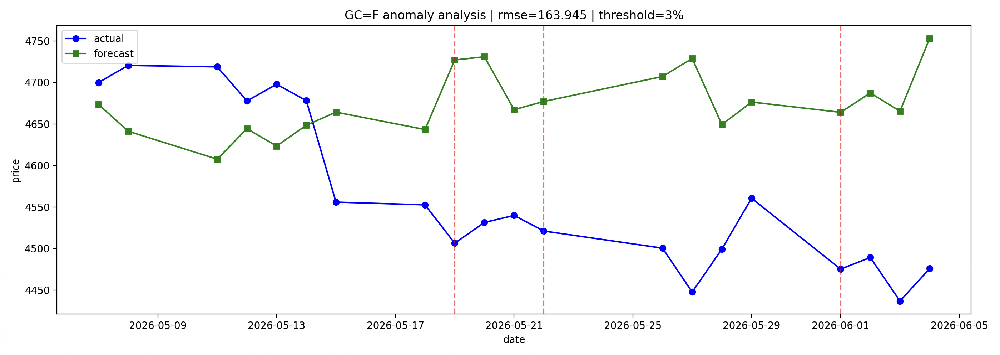
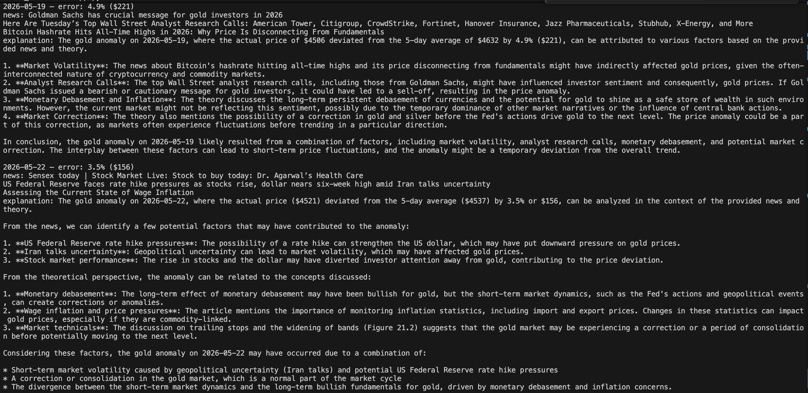
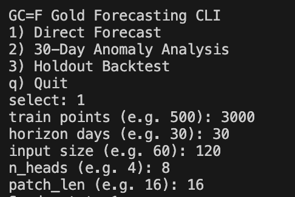
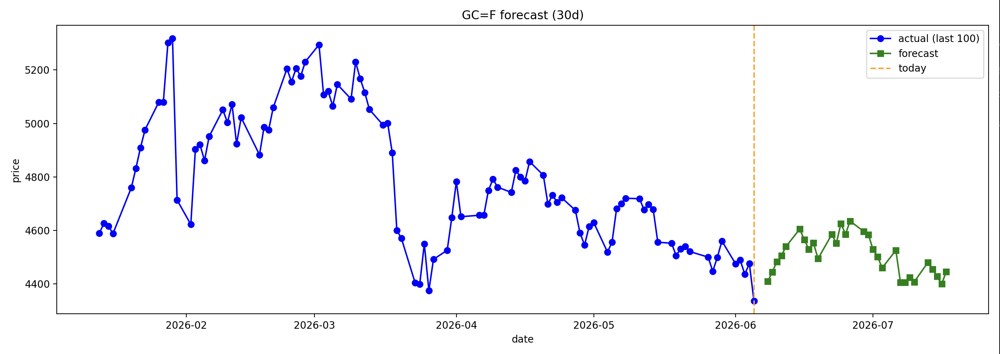
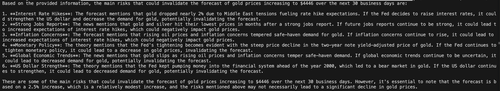

### Features

- Transformer-based forecasting with PatchTST
- Retrieval-Augmented Generation (RAG)
- Vector search with ChromaDB
- Financial document embeddings
- Real-time news integration
- LLM-based anomaly explanations
- Forecast risk analysis
- Out-of-sample backtesting

# gold-explainable-forecaster

Built an explainable AI system for financial market forecasting using a Transformer-based time-series model (PatchTST), Retrieval-Augmented Generation (RAG), vector embeddings, and Llama 3.3. The system forecasts gold prices, detects prediction anomalies, and generates contextual explanations using real-time news and domain-specific financial knowledge retrieved from a vector database.

**Tech Stack:**
PatchTST , Transformers , RAG , ChromaDB , HuggingFace Embeddings , Llama 3.3 , Groq , NewsAPI , Time-Series Forecasting , Explainable AI


---

## What does this do?

This is a CLI tool that forecasts gold futures (`GC=F`) prices using a transformer-based time series model. When the model is wrong, it doesn't just report the error - it explains *why* using real news from that day and theory pulled from technical analysis books.

Three modes:

1. **Direct Forecast** - train on recent history, predict the next N days
2. **30-Day Anomaly Analysis** - look back at the last 30 days, find where the model failed, explain each failure
3. **Holdout Backtest** - simulate a past forecast, measure out-of-sample accuracy

---

## Architecture

```
Yahoo Finance (GC=F)
       ↓
  PatchTST (NeuralForecast)
       ↓
  Anomaly Detection (error_pct > 3%)
       ↓
  NewsAPI  -->  Groq LLM (Llama 3.3-70b)  <--──  RAG (ChromaDB + HuggingFace)
                       ↓
              Explanation printed to CLI
```

### Component roles

| Component | Role |
|---|---|
| PatchTST | Transformer model that splits time series into patches and forecasts |
| ChromaDB + RAG | Retrieves relevant theory from 7 technical analysis books |
| NewsAPI | Fetches real headlines from the anomaly date |
| Groq LLM | Combines news + theory and explains the deviation |

---

## Modes

### 1. Direct Forecast

Train on the most recent N points, forecast H days into the future. Outputs a plot and a risk analysis generated by the LLM using recent news and RAG context.

```
train points (e.g. 500): 500
horizon days (e.g. 30): 30
input size (e.g. 60): 60
n_heads (e.g. 4): 4
patch_len (e.g. 16): 16
```

### 2. 30-Day Anomaly Analysis

Downloads the last 30 days of actual prices, runs the model on the training window before that period, and compares predictions to reality. Days where `error_pct > 3%` are flagged as anomalies. Consecutive anomaly days are grouped into single events.

For each anomaly event:
- fetches news headlines from that day
- queries the RAG system for relevant market theory
- sends both to the LLM for an explanation

```
train points (e.g. 500): 500
input size (e.g. 60): 60
n_heads (e.g. 4): 4
patch_len (e.g. 16): 16
```

### 3. Holdout Backtest

Simulates a real out-of-sample forecast at a point in the past.

```
offset from end (e.g. 500): 1000    <- go back 1000 days from today (split point)
train points (e.g. 3000): 3000      <-- use 3000 days before the split to train
horizon (e.g. 90): 30               <-- forecast 30 days after the split
input size (e.g. 60): 60            <- model looks at last 60 days to predict
n_heads (e.g. 4): 4                 <-- parallel attention heads in transformer
patch_len (e.g. 16): 16             <- time series is chunked into 16-day patches
```

**Parameter guide:**
- `offset_back` - sets where the test period starts. 1000 means "my test set begins 1000 days ago"
- `train_points` - how many days before the split point are used for training
- `horizon` - how many days after the split to forecast
- `input_size` - how many past days the model sees when making each prediction
- `n_heads` - how many attention perspectives the transformer uses simultaneously
- `patch_len` - the model processes the series in chunks of this many days

---

## Model - PatchTST

PatchTST (Patch Time Series Transformer) divides the time series into fixed-length patches and applies self-attention across them. This is more efficient than point-by-point attention and captures local temporal patterns better.

Key parameters:
- `h` - forecast horizon
- `input_size` - lookback window
- `max_steps` - training steps (set to 50 by default)
- `n_heads` - number of attention heads
- `patch_len` - patch size

---

## RAG System

7 technical analysis books are chunked (500 chars, 50 overlap), embedded with `all-MiniLM-L6-v2`, and stored in ChromaDB. On each anomaly, a query like:

```
gold price movement federal reserve interest rate geopolitical risk
inflation dollar correlation technical breakout price $X deviation Y%
```

...retrieves the 3 most relevant passages and injects them into the LLM prompt alongside the news.

Books used:
- Murphy - Technical Analysis of the Financial Markets
- Nison - Japanese Candlestick Charting Techniques
- Weldon - Gold Trading Boot Camp
- Pring - Study Guide for Technical Analysis Explained
- Johnson - The Complete Guide to Investing in Gold and Silver
- Vince - The Handbook of Portfolio Mathematics
- Jin et al. - Technical Analysis in Foreign Exchange Markets (2020)

---

## Mode comparison

| | Backtest | Anomaly Analysis | Direct Forecast |
|---|---|---|---|
| Anomaly detection | no | yes | no |
| LLM role | - | why did it fail? | what could go wrong? |
| RAG role | - | historical theory | historical + current |
| Value | accuracy measurement | transparency, learning | decision support |

---

## Installation

```bash
git clone https://github.com/asilburakcan/gold-explainable-forecaster.git
cd gold-explainable-forecaster

python -m venv venv
source venv/bin/activate

pip install -r requirements.txt
```

Copy `.env.example` to `.env` and fill in your keys and PDF paths:

```bash
cp .env.example .env
```

```
GROQ_API_KEY=your_groq_api_key
NEWS_API_KEY=your_newsapi_key

PDF_1=/path/to/pdf1.pdf
PDF_2=/path/to/pdf2.pdf
...
```

Run:

```bash
python app.py
```

---

## Disclaimer

Educational and research use only. Not financial advice.

---

## Screenshots

### Holdout Backtest - CLI Input
Parameters used for the backtest run shown below.



### Holdout Backtest - Result
Model trained on 3000 points, forecasting 30 days out-of-sample. RMSE=55.96.



### 30-Day Anomaly Analysis - CLI Input
Parameters used for the anomaly analysis run shown below.



### 30-Day Anomaly Analysis - Result
Actual vs predicted prices over the last 30 days. Red dashed lines mark anomaly events where model error exceeded 3%.



### 30-Day Anomaly Analysis - LLM Explanation
For each flagged anomaly, the system retrieves that day's news headlines and relevant passages from technical analysis books, then generates a structured explanation via Llama 3.3.



### Direct Forecast - CLI Input
Parameters used for the direct forecast run shown below.



### Direct Forecast - Result
30-day future forecast from today. Orange dashed line marks the prediction start point.



### Direct Forecast - Risk Analysis
After generating the forecast, the system queries recent news and book theory to identify risks that could invalidate the prediction.



---
---

# gold-explainable-forecaster (Türkçe)

Transformer tabanlı zaman serisi modeli (PatchTST), Retrieval-Augmented Generation (RAG), vektör veritabanı (ChromaDB), gerçek zamanlı haber entegrasyonu ve büyük dil modeli (Llama 3.3) bir araya getirilerek altın piyasası tahminlerini ve tahmin hatalarını açıklayan bir finansal yapay zeka sistemi.

**Tech Stack:**
PatchTST , Transformers , RAG , ChromaDB , HuggingFace Embeddings , Llama 3.3 , Groq , NewsAPI , Time-Series Forecasting , Explainable AI

---

## Ne yapıyor?

Bu araç, altın vadeli işlem sözleşmelerinin (`GC=F`) fiyatını transformer tabanlı bir zaman serisi modeliyle tahmin eden bir CLI uygulamasıdır. Model yanıldığında sadece hatayı raporlamakla kalmaz - o günün gerçek haberleri ve teknik analiz kitaplarından çekilen teorilerle *neden* yanıldığını açıklar.

Üç mod:

1. **Direct Forecast** - son N güne bakarak gelecekteki H günü tahmin et
2. **30-Day Anomaly Analysis** - son 30 günde modelin nerede yanıldığını bul, her hatayı açıkla
3. **Holdout Backtest** - geçmişte belirli bir noktada tahmin simülasyonu yap, doğruluğu ölç

---

## Mimari

```
Yahoo Finance (GC=F)
       ↓
  PatchTST (NeuralForecast)
       ↓
  Anomali Tespiti (error_pct > %3)
       ↓
  NewsAPI  -->  Groq LLM (Llama 3.3-70b)  <--──  RAG (ChromaDB + HuggingFace)
                       ↓
              Açıklama CLI'a yazdırılır
```

### Bileşen rolleri

| Bileşen | Rol |
|---|---|
| PatchTST | Zaman serisini parçalara bölerek tahmin yapan transformer modeli |
| ChromaDB + RAG | 7 teknik analiz kitabından ilgili teoriyi getirir |
| NewsAPI | Anomali günündeki gerçek haberleri çeker |
| Groq LLM | Haber ve teoriyi birleştirerek sapmayı açıklar |

---

## Modlar

### 1. Direct Forecast

En son N noktaya bakarak H gün ileriye tahmin üretir. Çıktı olarak grafik ve LLM tarafından üretilmiş risk analizi verir.

```
train points (e.g. 500): 500
horizon days (e.g. 30): 30
input size (e.g. 60): 60
n_heads (e.g. 4): 4
patch_len (e.g. 16): 16
```

### 2. 30-Day Anomaly Analysis

Son 30 günün gerçek fiyatlarını indirir, o dönemden önceki eğitim penceresinde modeli çalıştırır, tahminleri gerçekle karşılaştırır. `error_pct > %3` olan günler anomali olarak işaretlenir. Ardışık anomali günleri tek olay olarak gruplandırılır.

Her anomali olayı için:
- o günün haber başlıkları çekilir
- RAG sistemi ilgili piyasa teorisini getirir
- ikisi LLM'e gönderilerek açıklama üretilir

### 3. Holdout Backtest

Geçmişte belirli bir noktada gerçek dışı örneklem tahmini simüle eder.

```
offset from end (e.g. 500): 1000    <- bugünden 1000 gün geriye git (ayrım noktası)
train points (e.g. 3000): 3000      <-- ayrım noktasından önceki 3000 günü eğitimde kullan
horizon (e.g. 90): 30               <-- ayrımdan itibaren 30 gün ileriye tahmin et
input size (e.g. 60): 60            <- model her tahmin için son 60 güne bakar
n_heads (e.g. 4): 4                 <- transformer kaç farklı açıdan veriye baksın
patch_len (e.g. 16): 16             <-- zaman serisi 16 günlük parçalara bölünür
```

**Parametre rehberi:**
- `offset_back` - test setinin nerede başladığını belirler. 1000 → "test setim 1000 gün önce başlasın"
- `train_points` - ayrım noktasından önceki kaç günün eğitimde kullanılacağı
- `horizon` - ayrımdan sonra kaç günün tahmin edileceği
- `input_size` - her tahminde modelin kaç geçmiş güne baktığı
- `n_heads` - transformer'ın aynı anda kaç farklı attention perspektifi kullandığı
- `patch_len` - zaman serisinin kaç günlük parçalar halinde işlendiği

---

## Model - PatchTST

PatchTST (Patch Time Series Transformer), zaman serisini sabit uzunluklu parçalara böler ve bu parçalar arasında self-attention uygular. Nokta nokta attention'dan daha verimlidir ve yerel zamansal örüntüleri daha iyi yakalar.

Temel parametreler:
- `h` - tahmin ufku
- `input_size` - geriye bakış penceresi
- `max_steps` - eğitim adımı sayısı (varsayılan 50)
- `n_heads` - attention kafa sayısı
- `patch_len` - parça boyutu

---

## RAG Sistemi

7 teknik analiz kitabı 500 karakterlik parçalara bölünür (50 örtüşme), `all-MiniLM-L6-v2` ile gömülür ve ChromaDB'ye yüklenir. Her anomalide şuna benzer bir sorgu:

```
gold price movement federal reserve interest rate geopolitical risk
inflation dollar correlation technical breakout price $X deviation Y%
```

...en ilgili 3 pasajı getirir ve bunlar haber başlıklarıyla birlikte LLM promptuna eklenir.

Kullanılan kitaplar:
- Murphy - Technical Analysis of the Financial Markets
- Nison - Japanese Candlestick Charting Techniques
- Weldon - Gold Trading Boot Camp
- Pring - Study Guide for Technical Analysis Explained
- Johnson - The Complete Guide to Investing in Gold and Silver
- Vince - The Handbook of Portfolio Mathematics
- Jin ve ark. - Technical Analysis in Foreign Exchange Markets (2020)

---

## Mod karşılaştırması

| | Backtest | Anomali Analizi | Direct Forecast |
|---|---|---|---|
| Anomali tespiti | yok | var | yok |
| LLM rolü | - | neden yanıldı? | ne bozabilir? |
| RAG rolü | - | geçmiş teori | geçmiş + güncel |
| Değer | doğruluk ölçümü | şeffaflık, öğrenme | karar desteği |

---

## Kurulum

```bash
git clone https://github.com/asilburakcan/gold-explainable-forecaster.git
cd gold-explainable-forecaster

python -m venv venv
source venv/bin/activate

pip install -r requirements.txt
```

`.env.example` dosyasını `.env` olarak kopyala ve doldurun:

```bash
cp .env.example .env
```

```
GROQ_API_KEY=groq_api_keyin
NEWS_API_KEY=newsapi_keyin

PDF_1=/pdf/yolu/1.pdf
PDF_2=/pdf/yolu/2.pdf
...
```

Çalıştır:

```bash
python app.py
```

---

## Yasal Uyarı

Yalnızca eğitim ve araştırma amaçlıdır. Finansal tavsiye değildir.

---

## Ekran Görüntüleri

### Holdout Backtest - CLI Girişi
Aşağıdaki backtest çalıştırması için kullanılan parametreler.


### Holdout Backtest - Sonuç
3000 nokta üzerinde eğitim, 30 gün dışı örneklem tahmini. RMSE=55.96.


### 30-Day Anomaly Analysis - CLI Girişi
Aşağıdaki anomali analizi için kullanılan parametreler.


### 30-Day Anomaly Analysis - Sonuç
Son 30 günde gerçek vs tahmin fiyatları. Kırmızı kesik çizgiler, model hatasının %3'ü aştığı anomali günlerini gösterir.


### 30-Day Anomaly Analysis - LLM Açıklaması
Her anomali olayı için sistem o günün haberlerini ve teknik analiz kitaplarından ilgili pasajları getirir, Llama 3.3 aracılığıyla yapılandırılmış bir açıklama üretir.


### Direct Forecast - CLI Girişi
Aşağıdaki tahmin çalıştırması için kullanılan parametreler.


### Direct Forecast - Sonuç
Bugünden itibaren 30 günlük tahmin. Turuncu kesik çizgi tahmin başlangıç noktasını gösterir.


### Direct Forecast - Risk Analizi
Tahmin üretildikten sonra sistem güncel haberleri ve kitap teorisini sorgulayarak tahmini geçersiz kılabilecek riskleri tespit eder.


